# 📈 Zerodha Clone

A full-stack **Zerodha trading platform clone** that replicates core features of the **:contentReference[oaicite:0]{index=0}** web application, including user authentication, dashboard UI, stock listings, and order simulation.  
This project is built **for learning purposes only**.

---

## 🚀 Features

- 🔐 User Authentication (Login / Signup)
- 📊 Interactive Dashboard (Holdings, Positions, Orders)
- 📈 Stock Watchlist & Market View
- 💹 Buy & Sell Order Simulation (Paper Trading)
- 📱 Responsive UI (Desktop & Mobile)
- 🔄 Real-time UI Updates (Mock or API-based)

---

## 🛠️ Tech Stack

### Frontend
- React.js  
- HTML5, CSS3  
- JavaScript (ES6+)  
- Chart.js / Recharts  
- Axios  

### Backend
- Node.js  
- Express.js  
- REST APIs  

### Database
- MongoDB (Mongoose)

### Authentication & Security
- JWT (JSON Web Tokens)  
- Bcrypt (Password Hashing)

---

## 📂 Project Structure

ZerodhaClone/
│
├── dashboard/
│   ├── node_modules/
│   ├── public/
│   │   └── index.html
│   │
│   ├── src/
│   │   ├── components/
│   │   │   ├── Apps.js
│   │   │   ├── BuyActionWindow.js
│   │   │   ├── BuyActionWindow.css
│   │   │   ├── Dashboard.js
│   │   │   ├── DoughnoutChart.js
│   │   │   ├── Funds.js
│   │   │   ├── GeneralContext.js
│   │   │   ├── Holdings.js
│   │   │   ├── Home.js
│   │   │   ├── Menu.js
│   │   │   ├── Orders.js
│   │   │   ├── Positions.js
│   │   │   ├── Summary.js
│   │   │   ├── TopBar.js
│   │   │   ├── VerticalGraph.js
│   │   │   └── WatchList.js
│   │   │
│   │   ├── data/
│   │   │   └── data.js
│   │   │
│   │   ├── index.css
│   │   └── index.js
│   │
│   ├── .gitignore
│   ├── package.json
│   └── package-lock.json
│
└── README.md
frontend/
│
├── src/
│   ├── landing_page/
│   │   ├── home/
│   │   │   └── Stats.js
│   │   │
│   │   ├── pricing/
│   │   │   ├── Brokerage.js
│   │   │   ├── Hero.js
│   │   │   └── PricingPage.js
│   │   │
│   │   ├── products/
│   │   │   ├── Hero.js
│   │   │   ├── LeftSection.js
│   │   │   ├── ProductsPage.js
│   │   │   ├── RightSection.js
│   │   │   └── Universe.js
│   │   │
│   │   ├── signup/
│   │   │   └── SignUp.js
│   │   │
│   │   └── support/
│   │       ├── CreateTicket.js
│   │       ├── Hero.js
│   │       └── SupportPage.js
│   │
│   ├── Footer.js
│   ├── Navbar.js
│   ├── OpenAccount.js
│   │
│   ├── index.css
│   └── index.js
│
├── .gitignore
├── package.json
├── package-lock.json

2️⃣ Dashboard Setup
cd Dashboard
npm install
npm start

3️⃣ Frontend Setup

cd frontend
npm install
npm start

📸 ## Screenshots
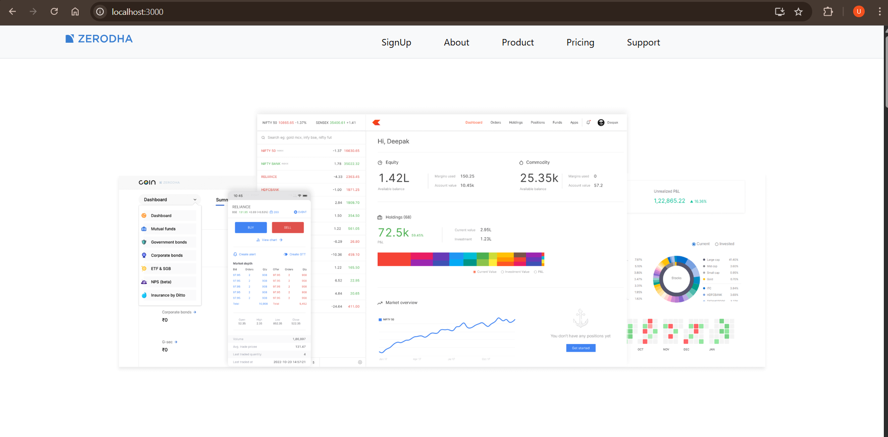
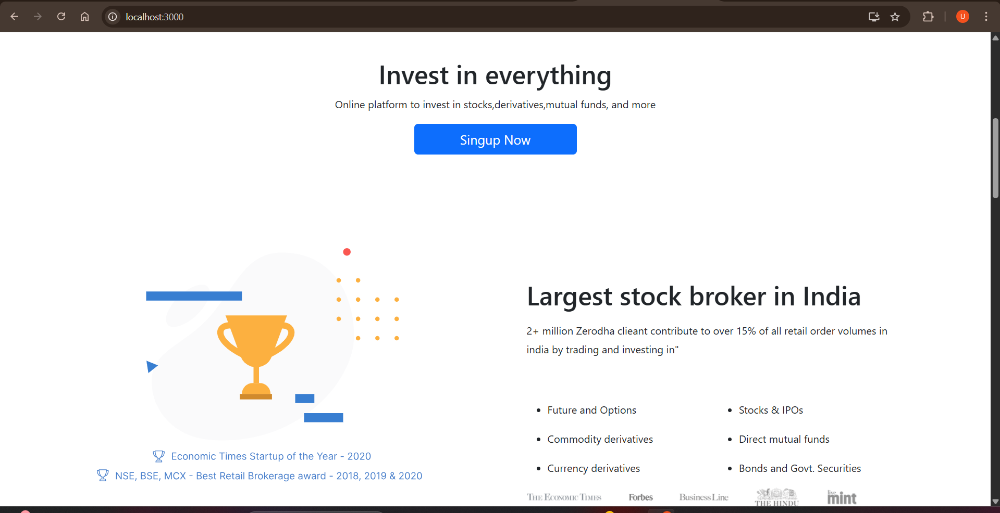

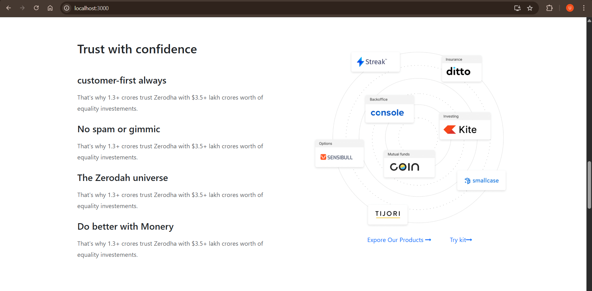
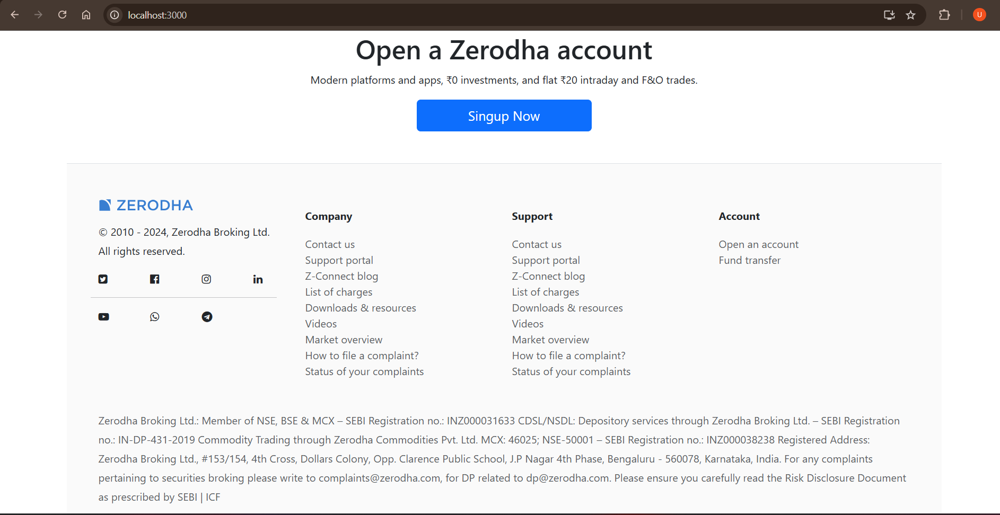
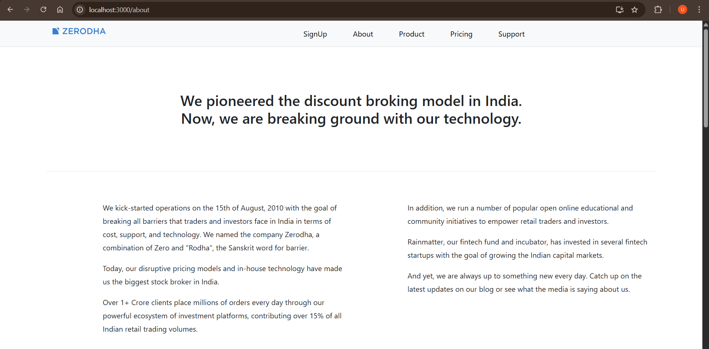
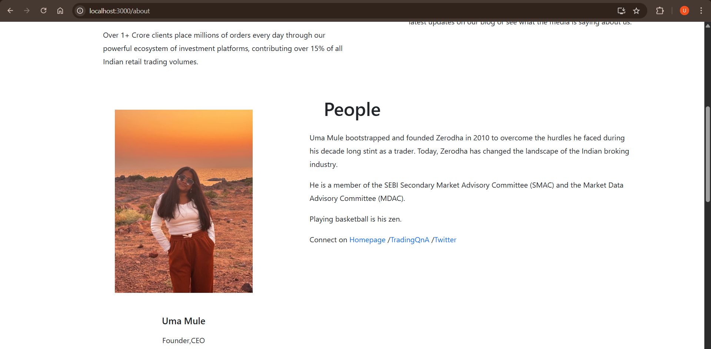
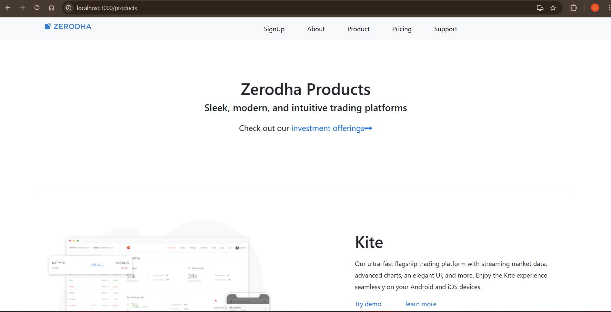
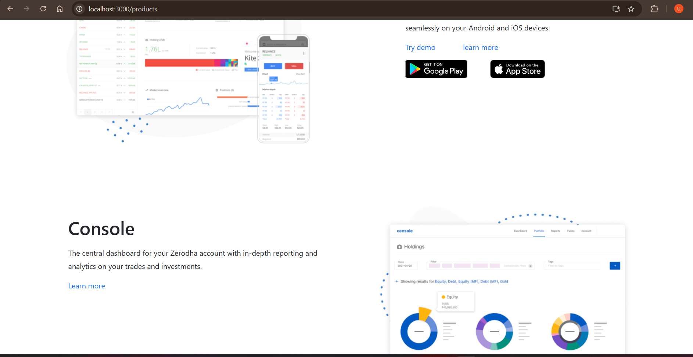
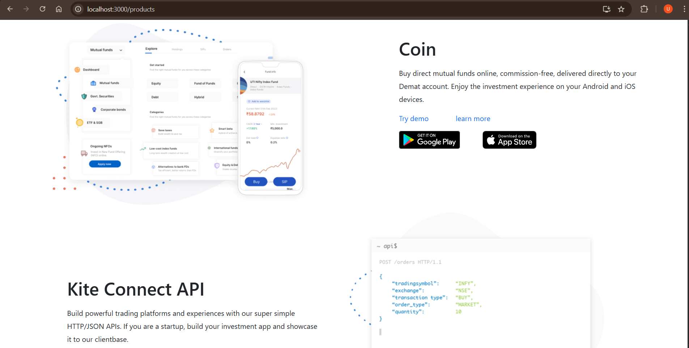

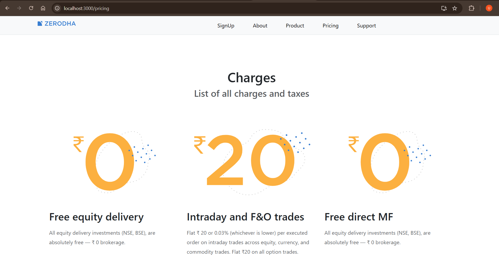
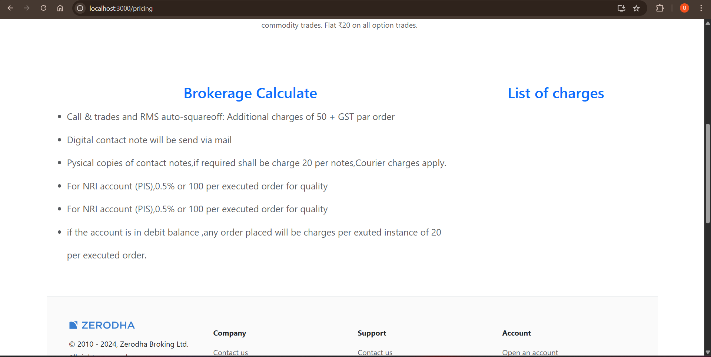
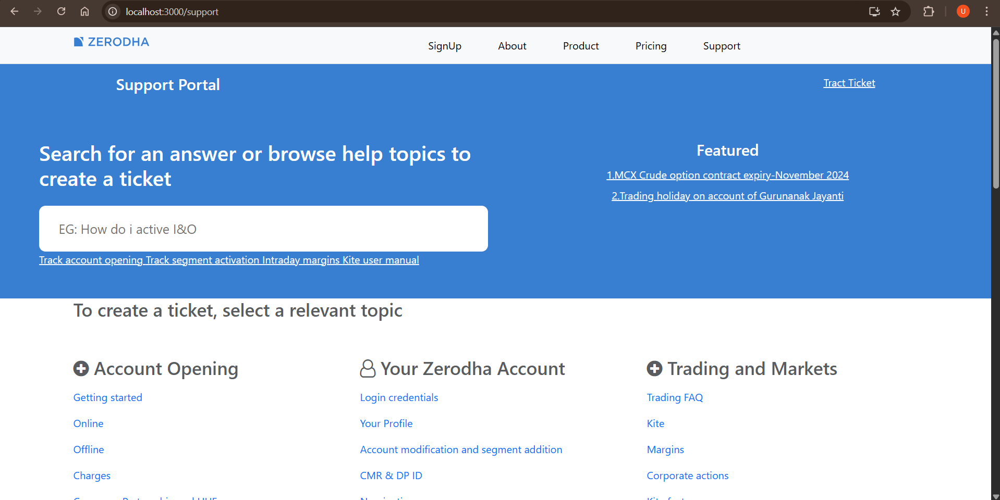
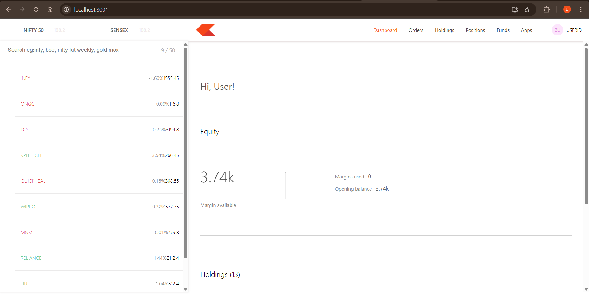
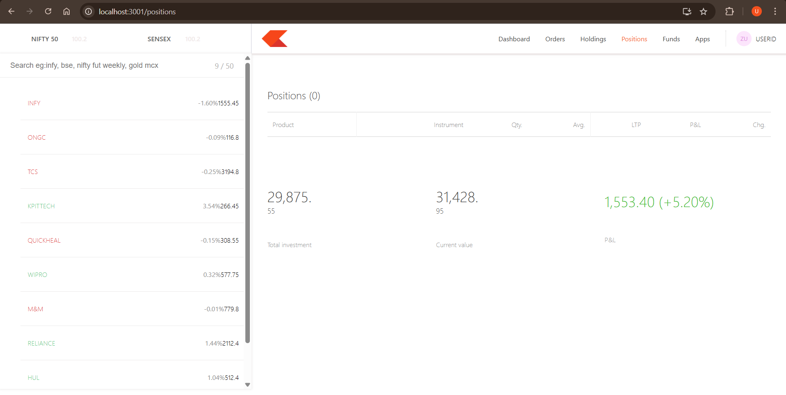
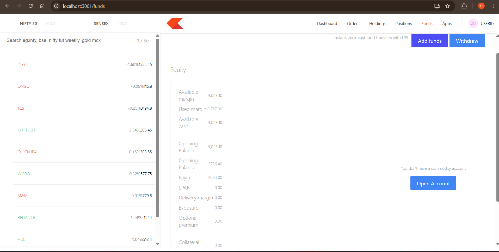
<video src="./video.mp4" controls></video>

